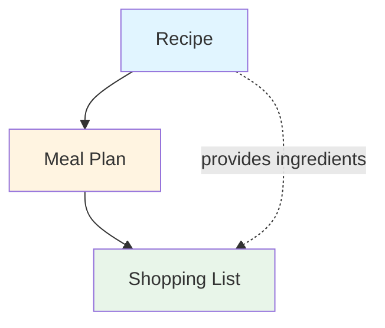

# Core Concepts

*Generated from client meeting*  
*Framework: The Essence of Software (Daniel Jackson)*  
*Date: 2026-02-01*

---

## Project Context

**MVP Goal**: Prove market viability and attract investors  
**Scope**: Recipe storage, weekly meal planning, shopping list generation  
**Authentication**: None required (ephemeral, localStorage-based)  
**Platform**: Web-based, mobile-friendly  
**Data Persistence**: Browser localStorage with demo seed data

---

## Concept 1: Recipe

**Purpose**: Store and manage cooking instructions and ingredient information

**Operational Principle**:  
When a user saves a recipe, the system captures the recipe name, ingredients with quantities, and cooking instructions. Users can later retrieve, view, edit, or delete their saved recipes.

**State**:
- `recipe_id` - Unique identifier
- `name` - Recipe name (string)
- `ingredients` - List of {ingredient_name, quantity, unit}
- `instructions` - Cooking steps (text or ordered list)
- `servings` - Number of servings (integer)
- `prep_time` - Preparation time in minutes (optional)
- `cook_time` - Cooking time in minutes (optional)

**Actions**:
- `create_recipe(name, ingredients, instructions, servings)` → recipe
- `edit_recipe(recipe_id, fields)` → recipe
- `get_recipe(recipe_id)` → recipe
- `list_all_recipes()` → recipe[]
- **MVP: No delete operation** (prevents complexity with meal plan references)

**Dependencies**: None (foundational concept)

---

## Concept 2: Meal Plan

**Purpose**: Organize recipes into a weekly schedule for meal planning

**Operational Principle**:  
Users assign recipes to specific days and meal times (breakfast, lunch, dinner) to create a weekly meal plan. The plan provides structure for what to cook and when, typically spanning 7 days.

**State**:
- `plan_id` - Unique identifier
- `week_start_date` - Start date of the week (Monday)
- `dinners` - Map of {day} → {recipe_id, servings}
  - Days: Monday through Sunday (0-6)
  - **MVP: Dinner only** (no breakfast/lunch)
  - Servings: Scaled quantity for recipe
- `notes` - Optional text per day (optional, may be Phase 2)

**Actions**:
- `create_plan(week_start_date)` → plan
- `assign_dinner(plan_id, day, recipe_id, servings)` → void
- `remove_dinner(plan_id, day)` → void
- `update_servings(plan_id, day, servings)` → void
- `get_plan(plan_id)` → plan
- `get_current_week_plan()` → plan

**Dependencies**: Recipe (meal plans reference recipes)

---

## Concept 3: Shopping List

**Purpose**: Aggregate ingredients from planned meals into a consolidated shopping list

**Operational Principle**:  
When a user generates a shopping list from their meal plan, the system extracts all ingredients from the assigned recipes, combines duplicate ingredients (summing quantities when units match), and organizes them into a list for grocery shopping.

**State**:
- `list_id` - Unique identifier
- `plan_id` - Reference to source meal plan
- `items` - List of {ingredient_name, total_quantity, unit}
- `generated_date` - Timestamp of generation
- `checked_items` - Set of ingredient_names marked as purchased

**Actions**:
- `generate_from_plan(plan_id)` → shopping_list
- `check_item(list_id, ingredient_name)` → void
- `uncheck_item(list_id, ingredient_name)` → void
- `clear_list(list_id)` → void
- `get_list(list_id)` → shopping_list

**Dependencies**: 
- Meal Plan (shopping list generated from meal plan)
- Recipe (indirect - aggregates ingredients from recipes in the plan)

---

## Concept Dependencies

**Build Order**: Recipe → Meal Plan → Shopping List

---

## MVP Scope

### In Scope
- ✅ Recipe create/edit operations (no delete)
- ✅ Weekly **dinner** planning (7-day vertical cards, Monday start)
- ✅ Recipe scaling (adjust servings when adding to meal plan)
- ✅ Auto-updating shopping list with ingredient aggregation
- ✅ Check/uncheck items on shopping list (grouped by category)
- ✅ Mobile-friendly responsive design (vertical day cards)
- ✅ 3 demo seed recipes
- ✅ Reset to demo data button

### Explicitly Out of Scope
- ❌ User authentication/login
- ❌ Multi-user support
- ❌ Recipe sharing between users
- ❌ Nutritional information
- ❌ Grocery delivery integration
- ❌ Recipe search/filtering
- ❌ Recipe images/photos
- ❌ Data backup/export
- ❌ Breakfast and lunch planning
- ❌ Recipe deletion
- ❌ Manual shopping list editing
- ❌ Multiple recipes per meal slot

---

## Technical Notes

**Data Storage**:
- All data stored in browser localStorage
- Data is ephemeral (lost on cache clear, no warning needed)
- **Seed data**: 3 sample recipes on first load
- **Reset button**: Restore original demo data for investor presentations

**Ingredient Aggregation Logic**:
- **Loose/fuzzy matching**: "milk" = "whole milk" = "2% milk"
- **Free-text units**: Users can type any unit (cups, tbsp, grams, etc.)
- **Fraction support**: Handle "1/2 cup + 1/4 cup = 3/4 cup"
- Sum quantities when units match (scaled by servings)
- Keep separate when units differ (e.g., "2 cups flour" and "1 tbsp flour")
- **"To taste" ingredients**: Show name only (e.g., "salt" instead of quantity)
- Case-insensitive matching for ingredient names
- **Group by category**: Produce, Dairy, Meat, Pantry, etc.

**Responsive Design**:
- Mobile-first approach
- **Vertical day cards** (not horizontal grid) for better mobile UX
- **Modal picker** for recipe selection (click day → modal opens → select recipe)
- Touch-friendly controls for adding/removing dinners
- Recipe list: scrollable (no search/filter in MVP)

---

## ✅ All Requirements Finalized

See [business-decisions.md](business-decisions.md) for complete decision log.

**Final Decisions**:
- Ingredient categories: Auto-detect using keyword matching
- Demo data: 3 recipes + pre-populated week
- Servings UI: Stepper buttons ([-] 4 servings [+])

---

## Success Metrics (for investor demo)

- User can create a recipe in < 2 minutes
- User can plan a full week of meals in < 5 minutes
- Shopping list generation is instant
- Mobile experience is smooth and intuitive
- Demo impresses potential investors with polish and usability
