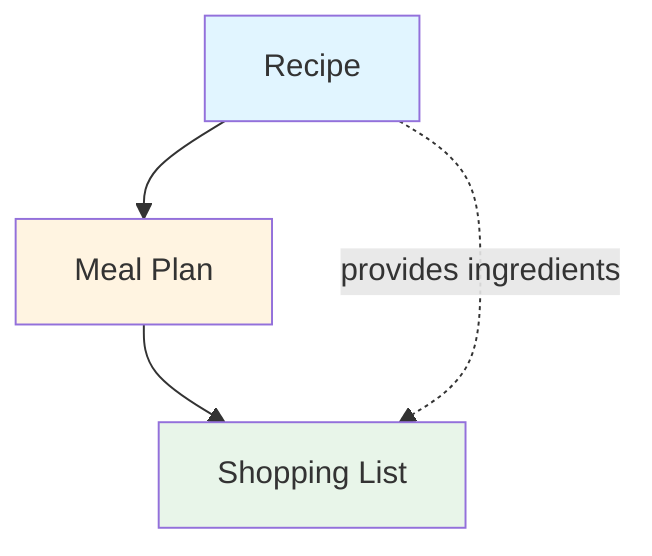

# Core Concepts

*Generated from client meeting*  
*Framework: The Essence of Software (Daniel Jackson)*  
*Date: 2026-02-01*

---

## Project Context

**MVP Goal**: Prove market viability and attract investors  
**Scope**: Recipe storage, weekly meal planning, shopping list generation  
**Authentication**: None required (ephemeral, localStorage-based)  
**Platform**: Web-based, mobile-friendly  
**Data Persistence**: Browser localStorage with demo seed data

---

## Concept 1: Recipe

**Purpose**: Store and manage cooking instructions and ingredient information

**Operational Principle**:  
When a user saves a recipe, the system captures the recipe name, ingredients with quantities, and cooking instructions. Users can later retrieve, view, edit, or delete their saved recipes.

**State**:
- `recipe_id` - Unique identifier
- `name` - Recipe name (string)
- `ingredients` - List of {ingredient_name, quantity, unit}
- `instructions` - Cooking steps (text or ordered list)
- `servings` - Number of servings (integer)
- `prep_time` - Preparation time in minutes (optional)
- `cook_time` - Cooking time in minutes (optional)

**Actions**:
- `create_recipe(name, ingredients, instructions, servings)` → recipe
- `edit_recipe(recipe_id, fields)` → recipe
- `delete_recipe(recipe_id)` → void
- `get_recipe(recipe_id)` → recipe
- `list_all_recipes()` → recipe[]

**Dependencies**: None (foundational concept)

---

## Concept 2: Meal Plan

**Purpose**: Organize recipes into a weekly schedule for meal planning

**Operational Principle**:  
Users assign recipes to specific days and meal times (breakfast, lunch, dinner) to create a weekly meal plan. The plan provides structure for what to cook and when, typically spanning 7 days.

**State**:
- `plan_id` - Unique identifier
- `week_start_date` - Start date of the week (date)
- `meals` - Map of {day, meal_time} → recipe_id
  - Days: Monday through Sunday (or 0-6)
  - Meal times: breakfast, lunch, dinner
- `notes` - Optional text per day/meal (optional)

**Actions**:
- `create_plan(week_start_date)` → plan
- `assign_meal(plan_id, day, meal_time, recipe_id)` → void
- `remove_meal(plan_id, day, meal_time)` → void
- `get_plan(plan_id)` → plan
- `get_current_week_plan()` → plan

**Dependencies**: Recipe (meal plans reference recipes)

---

## Concept 3: Shopping List

**Purpose**: Aggregate ingredients from planned meals into a consolidated shopping list

**Operational Principle**:  
When a user generates a shopping list from their meal plan, the system extracts all ingredients from the assigned recipes, combines duplicate ingredients (summing quantities when units match), and organizes them into a list for grocery shopping.

**State**:
- `list_id` - Unique identifier
- `plan_id` - Reference to source meal plan
- `items` - List of {ingredient_name, total_quantity, unit}
- `generated_date` - Timestamp of generation
- `checked_items` - Set of ingredient_names marked as purchased

**Actions**:
- `generate_from_plan(plan_id)` → shopping_list
- `check_item(list_id, ingredient_name)` → void
- `uncheck_item(list_id, ingredient_name)` → void
- `clear_list(list_id)` → void
- `get_list(list_id)` → shopping_list

**Dependencies**: 
- Meal Plan (shopping list generated from meal plan)
- Recipe (indirect - aggregates ingredients from recipes in the plan)

---

## Concept Dependencies

**Build Order**: Recipe → Meal Plan → Shopping List

---

## MVP Scope

### In Scope
- ✅ Recipe CRUD operations
- ✅ Weekly meal planning (7-day grid)
- ✅ Shopping list generation with ingredient aggregation
- ✅ Check/uncheck items on shopping list
- ✅ Mobile-friendly responsive design
- ✅ Demo seed data for initial recipes

### Explicitly Out of Scope
- ❌ User authentication/login
- ❌ Multi-user support
- ❌ Recipe sharing between users
- ❌ Nutritional information
- ❌ Grocery delivery integration
- ❌ Recipe search/filtering (unless needed for usability)
- ❌ Recipe images/photos
- ❌ Data backup/export

---

## Technical Notes

**Data Storage**:
- All data stored in browser localStorage
- Data is ephemeral (lost on cache clear)
- Seed data should include 5-10 sample recipes on first load

**Ingredient Aggregation Logic**:
- Combine ingredients with same name
- Sum quantities when units match (e.g., 2 cups + 1 cup = 3 cups)
- Keep separate when units differ (e.g., "2 cups flour" and "1 tbsp flour")
- Case-insensitive matching for ingredient names

**Responsive Design**:
- Mobile-first approach
- Meal plan grid should adapt to mobile (possibly vertical cards vs 7-column grid)
- Touch-friendly controls for adding/removing meals

---

## Open Questions

1. **Recipe Input**: Should users manually enter recipes or is there a simple import format (e.g., paste from web)?
2. **Meal Planning UX**: Drag-and-drop recipes onto calendar, or select from dropdown?
3. **Shopping List Organization**: Group by category (produce, dairy, etc.) or flat list?
4. **Multiple Weeks**: Should users be able to plan beyond current week, or just one week at a time?

*These should be addressed in design brief phase.*

---

## Success Metrics (for investor demo)

- User can create a recipe in < 2 minutes
- User can plan a full week of meals in < 5 minutes
- Shopping list generation is instant
- Mobile experience is smooth and intuitive
- Demo impresses potential investors with polish and usability